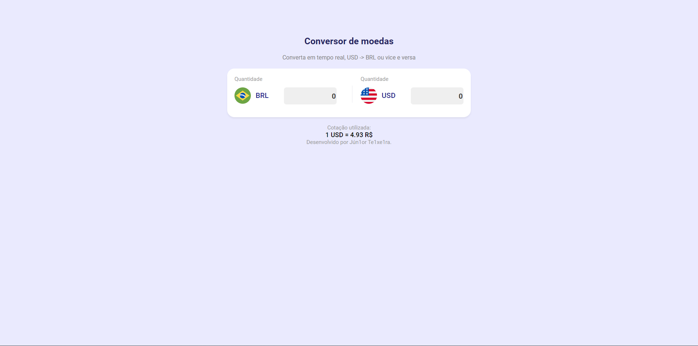
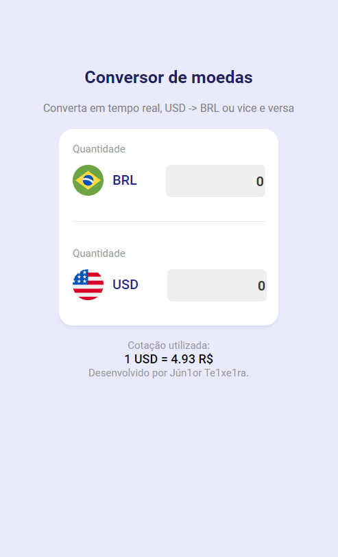

<h1 align="center">✅ Conversor de DOLAR PRA REAL</h1>

Pequeno projeto para estudos de css, html, javascript

<h2 align="center">✅ Do que se trata esse projeto? </h1>

Pequeno web app que faz a conversão em tempo real de dolar pra real e vice e versa

Este projeto é reponsivo e muda conforme o tamanho do dispositivo

Dispositivos movéis

